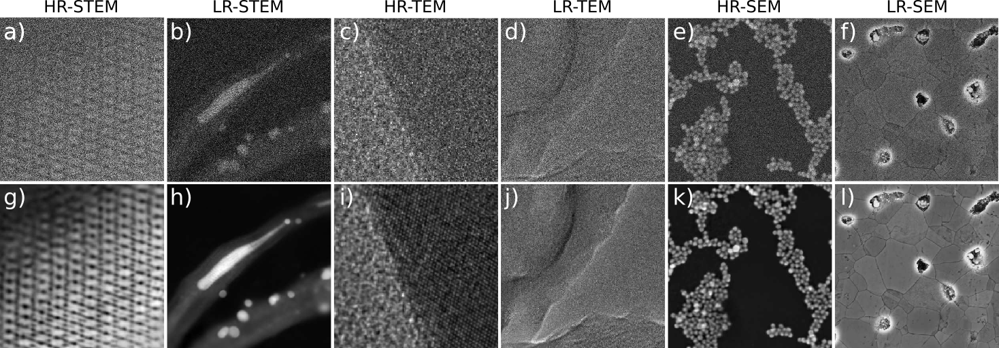

# Deep convolutional neural networks to restore single-shot electron microscopy images
I.Lobato<sup>1,2</sup>, T. Friedrich<sup>1,2</sup>, S. Van Aert<sup>1,2</sup>

<sup>1</sup>EMAT, University of Antwerp, Department of Physics, Groenenborgerlaan 171, B-2020 Antwerp, Belgium

<sup>2</sup>NANOlab Center of Excellence, University of Antwerp, Department of Physics, Groenenborgerlaan 171, B-2020 Antwerp, Belgium

## Overview
State-of-the-art electron microscopes such as scanning electron microscopes (SEM), scanning transmission electron microscopes (STEM) and transmission electron microscopes (TEM) have become increasingly sophisticated. However, the quality of experimental images is often hampered by stochastic and deterministic distortions arising from the instrument or its environment. These distortions can arise during any stage of the imaging process, including image acquisition, transmission, or visualization. In this paper, we will discuss the main sources of distortion in TEM and S(T)EM images, develop models to describe them and propose a method to correct these distortions using a convolutional neural network. We demonstrate the effectiveness of our approach on a variety of experimental images and show that it can significantly improve the signal-to-noise ratio resulting in an increase in the amount of quantitative structural information that can be extracted from the image. Overall, our findings provide a powerful framework for improving the quality of electron microscopy images and advancing the field of structural analysis and quantification in materials science and biology. The source code and trained models for our approach are made available in the accompanying repository.

# Installation via Pip
To use r_em, you need to install TensorFlow and its CUDA libraries if you want to use GPU acceleration. The specific version of TensorFlow required by r_em depends on your operating system. It is recommended to install TensorFlow in a virtual environment to avoid conflicts with other packages.

## 1. Create a conda environment
[miniconda](https://docs.conda.io/en/latest/miniconda.html) is the recommended approach for installing TensorFlow with GPU support. It creates a separate environment to avoid changing any installed software in your system. This is also the easiest way to install the required software especially for the GPU setup.

Let us start by creating a new conda environment and activate it with the following command:

```bash
conda create -n py310_gpu python=3.10.*
conda activate py310_gpu
```

## 2. Setting up GPU (optional)
If you plan to run TensorFlow on a GPU, you'll need to install the NVIDIA GPU driver and then install CUDA and cuDNN using Conda. You can use the following command to install them::

```
conda install -c conda-forge cudatoolkit=11.2.* cudnn=8.1.*
```

To ensure that the system paths recognize CUDA when your environment is activated, you can run the following commands ([Tensorflow step by step](https://www.tensorflow.org/install/pip#linux_1)):

```bash
mkdir -p $CONDA_PREFIX/etc/conda/activate.d
echo 'export LD_LIBRARY_PATH=$LD_LIBRARY_PATH:$CONDA_PREFIX/lib/' > $CONDA_PREFIX/etc/conda/activate.d/env_vars.sh
```
These commands create a shell script in the activate.d directory, which sets the LD_LIBRARY_PATH environment variable when your environment is activated. This allows TensorFlow to locate the CUDA libraries that it needs to run on the GPU.

## 3. Install Tensorflow

### Windows
If you're using Windows, install TensorFlow version 2.10.*. TensorFlow 2.10 was the last TensorFlow release that supported GPU on native-Windows. Starting with TensorFlow 2.11, you will need to install TensorFlow in WSL2 or install tensorflow-cpu instead. Use the following command to install TensorFlow:

```
pip install tensorflow==2.10.*
```
### Linux
If you're using Linux, install TensorFlow version 2.11.* using pip:

```
pip install tensorflow==2.11.*
```

## 4. Install r_em
Once you've installed TensorFlow, you can install **r_em** using pip:

```
pip install r_em
```
This command will install the latest version of **r_em** and its required dependencies.

## 5. Python example
You can now use **r_em** in your Python code. Here's an example:

```python
import os
import numpy as np
import matplotlib

# Check if running on remote SSH and use appropriate backend for matplotlib
remote_ssh = "SSH_CONNECTION" in os.environ
matplotlib.use('Agg' if remote_ssh else 'TkAgg')
import matplotlib.pyplot as plt

from r_em.model import load_r_em_net, load_test_data

# select network
net = 'hrstem'

# load its corresponding data
x, y = load_test_data(net)

 # load its corresponding model
net_r_cbed = load_r_em_net(net)
net_r_cbed.summary()

n_data = x.shape[0]
batch_size = 16

# run inference
y_p = net_r_cbed.predict(x, batch_size)

fig, axs = plt.subplots(1, 3, figsize=(12, 6))

cb = [None, None, None]

for ik in range(n_data):
    x_ik = x[ik, :, :, 0].squeeze()
    y_ik = y[ik, :, :, 0].squeeze()
    y_p_ik = y_p[ik, :, :, 0].squeeze()

    vmin = min(y_ik.min(), y_p_ik.min())
    vmax = max(y_ik.max(), y_p_ik.max())

    axs[0].imshow(x_ik, cmap='viridis')
    axs[0].set_xticks([])
    axs[0].set_yticks([])
    axs[0].grid(False)
    axs[0].set_title(f"Detected {net} image", fontsize=14)
    if cb[0] is not None:
        cb[0].remove()
    cb[0] = fig.colorbar(axs[0].images[0], ax=axs[0], orientation='vertical', shrink=0.6)

    axs[1].imshow(y_p_ik, vmin=vmin, vmax=vmax, cmap='viridis')
    axs[1].set_xticks([])
    axs[1].set_yticks([])
    axs[1].grid(False)
    axs[1].set_title(f"Restored {net} image", fontsize=14)
    if cb[1] is not None:
        cb[1].remove()
    cb[1] = fig.colorbar(axs[1].images[0], ax=axs[1], orientation='vertical', shrink=0.6)

    axs[2].imshow(y_ik, vmin=vmin, vmax=vmax, cmap='viridis')
    axs[2].set_xticks([])
    axs[2].set_yticks([])
    axs[2].grid(False)
    axs[2].set_title(f"Ground truth {net} image", fontsize=14)
    if cb[2] is not None:
        cb[2].remove()
    cb[2] = fig.colorbar(axs[2].images[0], ax=axs[2], orientation='vertical', shrink=0.6)

    if remote_ssh:
        plt.savefig(f"restored_{net}.png", format='png')
    else:
        fig.show()

    print(ik)
```

## 5. Performance
All models of **r_em** have been optimized to run on a standard desktop computer, and its performance can be significantly improved by utilizing GPU acceleration.

## 5. How to cite:
**Please cite r_em in your publications if it helps your research:**

```bibtex
    @article{LCK_2023,
      Author = {I.Lobato and T. Friedrich and S. Van Aert},
      Journal = {npj computational materials},
      Title = {Deep convolutional neural networks to restore single-shot electron microscopy images},
      Year = {2023},
      volume  = {xxx},
      pages   = {xxx-xxx}
    }